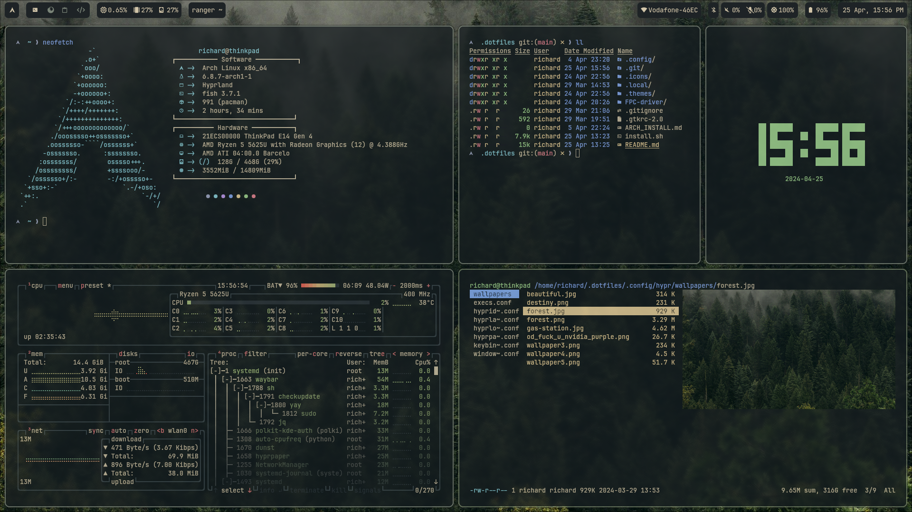
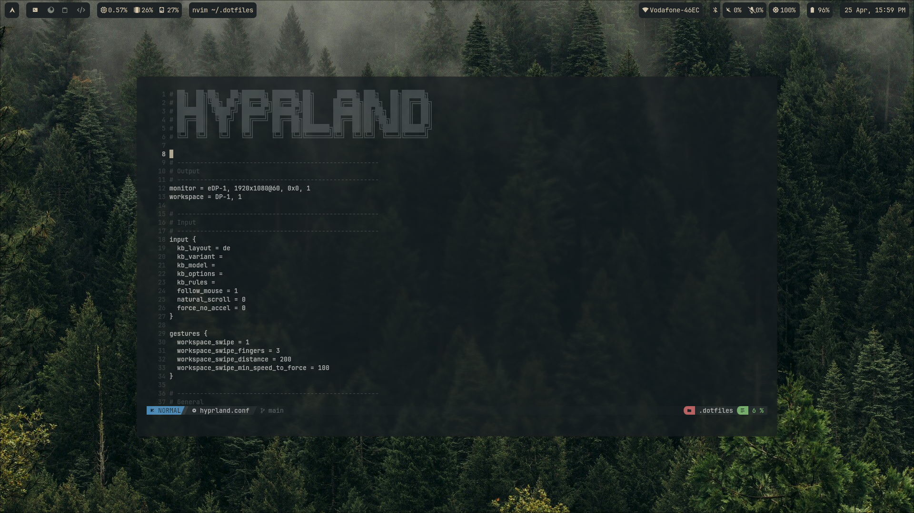
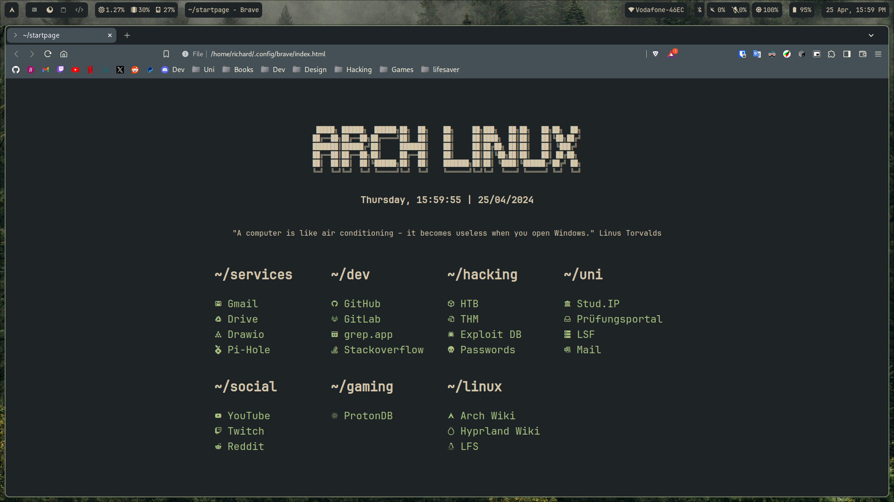
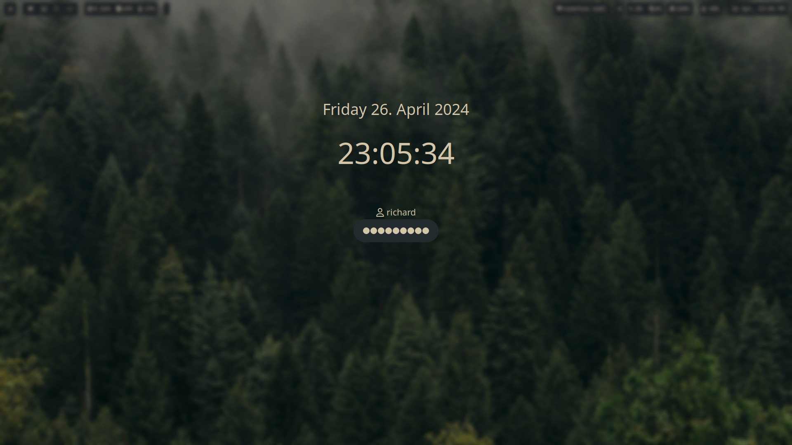
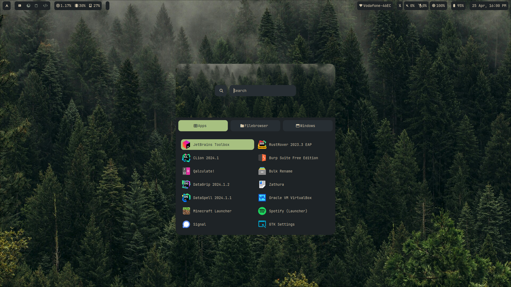
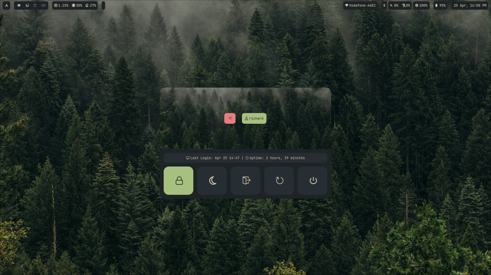
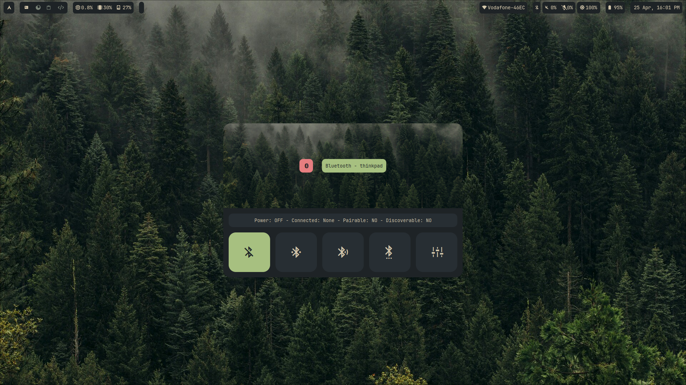
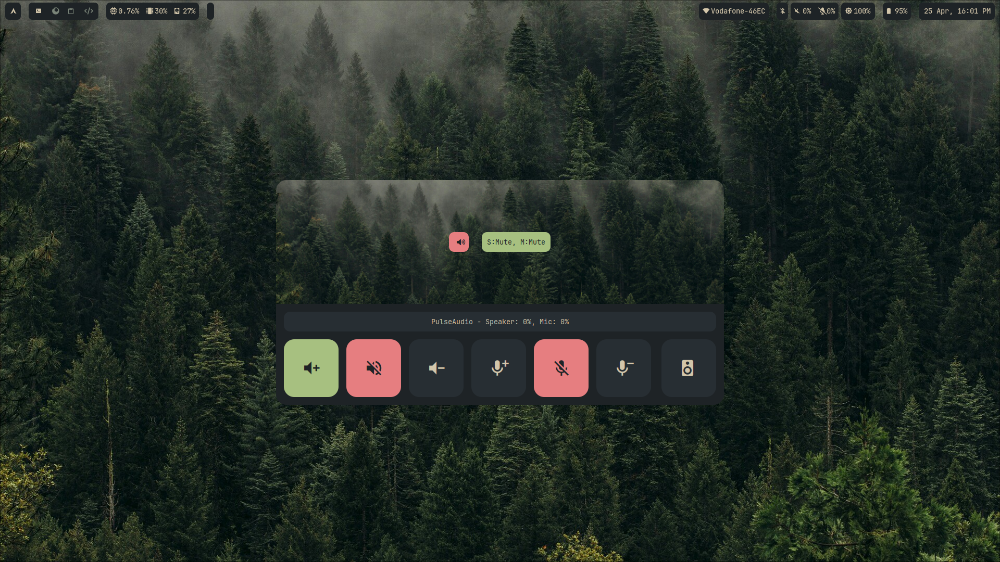
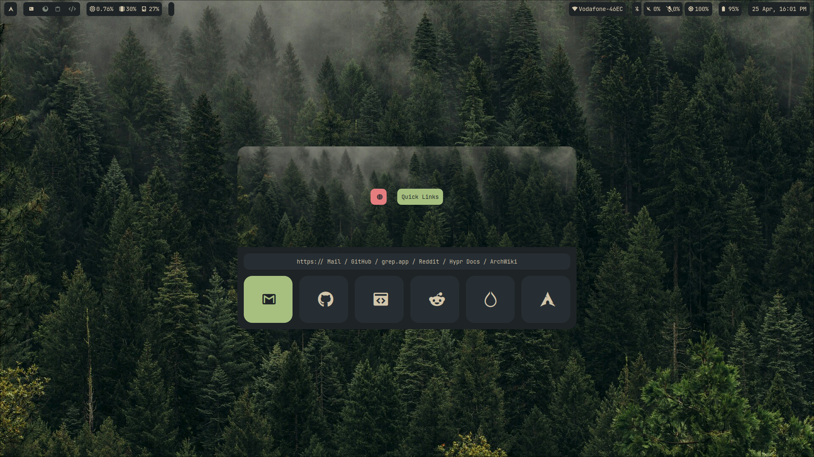

```
██████╗  ██████╗ ████████╗███████╗██╗██╗     ███████╗███████╗
██╔══██╗██╔═══██╗╚══██╔══╝██╔════╝██║██║     ██╔════╝██╔════╝
██║  ██║██║   ██║   ██║   █████╗  ██║██║     █████╗  ███████╗
██║  ██║██║   ██║   ██║   ██╔══╝  ██║██║     ██╔══╝  ╚════██║
██████╔╝╚██████╔╝   ██║   ██║     ██║███████╗███████╗███████║
╚═════╝  ╚═════╝    ╚═╝   ╚═╝     ╚═╝╚══════╝╚══════╝╚══════╝
```

---
1. [Preview](#preview)
2. [Installation](#installation)
3. [Packages](#packages)
    1. [Hypr](#hypr)
    2. [Essentials](#essentials)
    3. [Drivers](#drivers)
       1. [Sound](#sound)
       2. [Graphics](#graphics)
       3. [Bluetooth](#bluetooth)
       4. [Other](#other)
    4. [Programs](#programs)
        1. [Terminal](#terminal)
        2. [Graphical](#graphical)
    5. [Fonts](#fonts)
    6. [Other](#other)
4. [Configuration](#configuration)
    1. [Git](#git)
    2. [Bluetooth](#bluetooth)
    3. [fprintd](#fprintd)
---

## Preview
|  |  |
| --- | --- |
|  |  |

|  |  |
| --- | --- |
|  |  |
|  |  |

## Installation (not finished yet)
Clone Repository and give execution rights:
```console
git clone https://github.com/Bluewolf787/dotfiles.git .dotfiles
cd .dotfiles
chmod +x install.sh
```
Install complete:
```console
./install.sh all
```
Install only dotfiles:
```console
./install.sh dotfiles
```


## Packages
### Hypr
- [hyprland](https://archlinux.org/packages/extra/x86_64/hyprland/) | https://github.com/hyprwm/Hyprland
- [hyprlock](https://archlinux.org/packages/extra/x86_64/hyprlock/) | https://github.com/hyprwm/hyprlock
- [hypridle](https://archlinux.org/packages/extra/x86_64/hypridle/) | https://github.com/hyprwm/hypridle
- [hyprpaper](https://archlinux.org/packages/extra/x86_64/hyprpaper/) | https://github.com/hyprwm/hyprpaper
- [hyprcursor](https://archlinux.org/packages/extra/x86_64/hyprcursor/) | https://github.com/hyprwm/hyprcursor
- [hyprpicker-git](https://aur.archlinux.org/packages/hyprpicker-git)<sup>AUR</sup> | https://github.com/hyprwm/hyprpicker
- [xdg-desktop-portal-hyprland](https://archlinux.org/packages/extra/x86_64/xdg-desktop-portal-hyprland/) | https://github.com/hyprwm/xdg-desktop-portal-hyprland
- [hyprshot](https://aur.archlinux.org/packages/hyprshot)<sup>AUR</sup> | https://github.com/Gustash/Hyprshot
- [hyprwayland-scanner](https://archlinux.org/packages/extra/x86_64/hyprwayland-scanner/) | https://github.com/hyprwm/hyprwayland-scanner

### Essentials
- [git](https://archlinux.org/packages/extra/x86_64/git/) | https://git-scm.com/
- [waybar](https://archlinux.org/packages/extra/x86_64/waybar/) | https://github.com/Alexays/Waybar/
- [kitty](https://archlinux.org/packages/extra/x86_64/kitty/) | https://github.com/kovidgoyal/kitty
- [rofi-lbonn-wayland-git](https://aur.archlinux.org/packages/rofi-lbonn-wayland-git)<sup>AUR</sup> | https://github.com/lbonn/rofi
- [dunst](https://archlinux.org/packages/extra/x86_64/dunst/) | https://dunst-project.org/
- [fish](https://archlinux.org/packages/extra/x86_64/fish/) | https://fishshell.com/
- [ly](https://archlinux.org/packages/extra/x86_64/ly/) | https://github.com/fairyglade/ly
- [brightnessctl](https://archlinux.org/packages/extra/x86_64/brightnessctl/) | https://github.com/Hummer12007/brightnessctl
- [polkit-kde-agent](https://archlinux.org/packages/extra/x86_64/polkit-kde-agent/) | https://kde.org/plasma-desktop/
- [pacman-contrib](https://archlinux.org/packages/extra/x86_64/pacman-contrib/) | https://gitlab.archlinux.org/pacman/pacman-contrib

### Drivers
###### Sound:
- [pipewire](https://archlinux.org/packages/extra/x86_64/pipewire/) | https://pipewire.org
- [libpipewire](https://archlinux.org/packages/extra/x86_64/libpipewire/) | https://pipewire.org

###### Graphics:
- [amd-ucode](https://archlinux.org/packages/core/any/amd-ucode/) | https://gitlab.com/kernel-firmware/linux-firmware
- [xf86-video-amdgpu](https://archlinux.org/packages/extra/x86_64/xf86-video-amdgpu/) | https://xorg.freedesktop.org/
- [vulkan-radeon](https://archlinux.org/packages/extra/x86_64/vulkan-radeon/) | https://www.mesa3d.org/
- [mesa](https://archlinux.org/packages/extra/x86_64/mesa/) | https://www.mesa3d.org/
- [libva-mesa-driver](https://archlinux.org/packages/extra/x86_64/libva-mesa-driver/) | https://www.mesa3d.org/

###### Bluetooth:
- [bluez](https://archlinux.org/packages/extra/x86_64/bluez/) | http://www.bluez.org/
- [bluez-utils](https://archlinux.org/packages/extra/x86_64/bluez-utils/) | http://www.bluez.org/

###### Other:
- [fprintd](https://archlinux.org/packages/extra/x86_64/fprintd/) | https://fprint.freedesktop.org/
- [libfprint](https://archlinux.org/packages/extra/x86_64/libfprint/) | https://fprint.freedesktop.org/
- [cpio](https://archlinux.org/packages/extra/x86_64/cpio/) | https://www.gnu.org/software/cpio/

### Programs
###### Terminal
- [neovim](https://archlinux.org/packages/extra/x86_64/neovim/) | https://neovim.io/
- [btop](https://archlinux.org/packages/extra/x86_64/btop/) | https://github.com/aristocratos/btop
- [bat](https://archlinux.org/packages/extra/x86_64/bat/) | https://github.com/sharkdp/bat
- [eza](https://archlinux.org/packages/extra/x86_64/eza/) | https://github.com/eza-community/eza
- [docker](https://archlinux.org/packages/extra/x86_64/docker/) | https://www.docker.com/
- [nmap](https://archlinux.org/packages/extra/x86_64/nmap/) | https://nmap.org/

###### Graphical
- [polkit-kde-agent](https://archlinux.org/packages/extra/x86_64/polkit-kde-agent/) | https://kde.org/plasma-desktop/
- [nwg-look](https://archlinux.org/packages/extra/x86_64/nwg-look/) | https://github.com/nwg-piotr/nwg-look
- [thunar](https://archlinux.org/packages/extra/x86_64/thunar/) | https://docs.xfce.org/xfce/thunar/start
- [brave-bin](https://aur.archlinux.org/packages/brave-bin)<sup>AUR</sup> | https://brave.com
- [spotify-launcher](https://archlinux.org/packages/extra/x86_64/spotify-launcher/) | https://github.com/kpcyrd/spotify-launcher
- [discord](https://archlinux.org/packages/extra/x86_64/discord/) | https://discord.com
- [termius](https://aur.archlinux.org/packages/termius)<sup>AUR</sup> | https://www.termius.com/
- [docker-desktop](https://aur.archlinux.org/packages/docker-desktop)<sup>AUR</sup> | https://www.docker.com/products/docker-desktop/
- [virtualbox-host-modules-arch](https://archlinux.org/packages/extra/x86_64/virtualbox-host-modules-arch/) | https://virtualbox.org/
- [virtualbox](https://archlinux.org/packages/extra/x86_64/virtualbox/) | https://virtualbox.org/
- [jetbrains-toolbox](https://aur.archlinux.org/packages/jetbrains-toolbox)<sup>AUR</sup> | https://www.jetbrains.com/toolbox-app/

### Programming
- [jdk-openjdk](https://archlinux.org/packages/extra/x86_64/jdk-openjdk/) | https://openjdk.org/
- [jdk17-openjdk](https://archlinux.org/packages/extra/x86_64/jdk17-openjdk/) | https://openjdk.org/
- [dart](https://archlinux.org/packages/extra/x86_64/dart/) | https://dart.dev

### Fonts
- [nerd-fonts](https://archlinux.org/packages/?sort=&q=nerd+fonts&maintainer=&flagged=) | https://www.nerdfonts.com/
- [noto-fonts-emoji](https://archlinux.org/packages/extra/any/noto-fonts-emoji/) | https://archlinux.org/packages/extra/any/noto-fonts-emoji/

### Other
#### Minegrub
[Minegrub](https://github.com/Lxtharia/minegrub-theme) is a Minecraft like Grub theme by [Lxtharia](https://github.com/Lxtharia).

#### NvChad
[NvChad](https://nvchad.com/) is a Neovim config by [siduck](https://github.com/siduck).

#### Flutter
[Flutter](https://flutter.dev) is an open source framework by Google for building beautiful, natively compiled, multi-platform applications from a single codebase.

#### Fishmarks
[Fishmarks](https://github.com/techwizrd/fishmarks) is a clone of [bashmarks](https://github.com/huyng/bashmarks) for the Fish shell by [techwizrd](https://github.com/techwizrd)

#### Hyprland Plugins
[hyprland-plugins](https://github.com/hyprwm/hyprland-plugins) is a collection of official plugins for Hyprland. 

## Configuration
### Git
**Add git log alias:**
```console
git config --global alias.lg "log --color --graph --pretty=format:'%Cred%h%Creset -%C(yellow)%d%Creset %s %Cgreen(%cr) %C(bold blue)<%an>%Creset' --abbrev-commit"
```
Usage:
```console
git lg
git lg -2 -p       # last two commit with line changes
```

**Add git status alias:**
```console
git config --global alias.ss "status -s"
```

### Hyprland Plugins
```bash
hyprpm add https://github.com/hyprwm/hyprland-plugins
hyprpm enable hyprbars
```

### Bluetooth
```console
pacman -S bluez bluez-utils
```

```console
systemctl enable bluetooth.service
```
**Disable auto start:**
```console
sudo vim /etc/bluetooth/main.conf
```
Change line 321 `#AutoEnable=true` to
```
AutoEnable=false
```

### fprintd
This applies for my ThinkPad E14 Gen 4 with the device PID `0x9800`.

Verify the fingerprint reader
```console
...
Bus 003 Device 002: ID 10a5:9800 FPC FPC Sensor Controller L:0001 FW:16.26.23.14
...
```

Install [fprint](https://archlinux.org/packages/?sort=&q=fprint) package group
```console
pacman -S fprint
```

<details>
<summary>Install the official driver from <a href="https://pcsupport.lenovo.com/de/de/products/laptops-and-netbooks/thinkpad-edge-laptops/thinkpad-e14-gen-4-type-21eb-and-21ec/downloads/driver-list/component?name=Fingerprint%20Reader" >Lenovo</a> (following applies for Arch Linux)</summary>
<br>
More information <a href="https://download.lenovo.com/pccbbs/mobiles/r1slm02w.txt">here</a>
<br>
Download and extract the zip-archive then copy the files as shown below
<br>
<pre>
cd FPC_driver_linux_27.26.23.39/install_fpc
sudo cp ./libfpcbep.so /usr/lib/
<br>
cd FPC_driver_linux_libfprint/install_libfprint/
sudo cp lib/udev/rules.d/60-libfprint-2-device-fpc.rules /lib/
sudo cp usr/lib/x86_64-linux-gnu/* /usr/lib/
</pre>
</details>

Or use my script in `FPC-driver/`
```console
cd FPC-driver
chmod +x install.sh
./install.sh
```

Set up for hyprlock `/etc/pam.d/hyprlock`
```
# PAM configuration file for hyprlock
# the 'login' configuration file (see /etc/pam.d/login)

auth	    sufficient  pam_fprintd.so
auth        include     login
```

Set up for ly `/etc/pam.d/ly`
```
#%PAM-1.0

auth 	   sufficient   pam_unix.so try_first_pass likeauth nullok
auth	   sufficient   pam_fprintd.so
auth       include      login
account    include      login
password   include      login
session    include      login
```

### Power Button Behavior
Edit `logind.conf` in `/etc/systemd/`. <br>
Change line 27 and 28 from
```
#HandlePowerKey=poweroff
#HandlePowerKeyLongPress=ignore
```
to this
```
HandlePowerKey=ignore
HandlePowerKeyLongPress=poweroff
```
